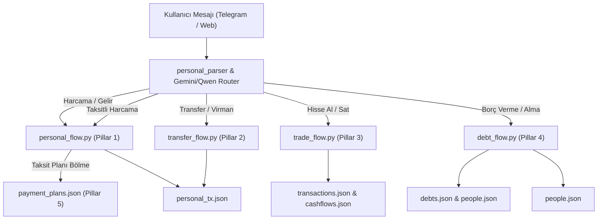

# BBB Tracker — 5 Sütunlu Bütünleşik Finansal Motor Tasarım ve Geliştirme Raporu

**Tarih:** 8 Eylül 2026  
**Sürüm:** v2.0 (Unified 5-Pillar Architecture)  
**Hedef:** Kişisel servet yönetiminin tüm yönlerini (harcama, transfer, yatırım, borç/alacak, taksitler) tek bir akıllı, konuşkan ve tutarlı finansal motorda birleştirmek.

---

## 1. Yönetici Özeti

Kullanıcının isteği doğrultusunda, bir bireyin tüm finansal hareketlerini eksiksiz karşılayan 5 sütunlu mimari sıfırdan tasarlanıp inşa edildi:

1. **Harcamalar / Gelirler (Income & Expense):** Günlük yaşam nakit akışları, otomatik veya yapay zeka destekli kategori sınıflandırması.
2. **Transferler / Virman (Inter-Account Transfers):** Bankadan bankaya transfer, ATM'den nakit çekme, nakit yatırma, kredi kartı borç ödemesi (net serveti değiştirmez, harcama sayılmaz).
3. **Yatırımlar (Investments):** BIST hisse senedi alım/satım işlemleri, eksik fiyat/kurum/portföy bilgisi sorma akışı.
4. **Borç / Alacak (Lending & Borrowing):** Arkadaşa/tanıdığa borç verme/alma, otomatik kişi kaydı, `/borclar` üzerinden tek tuşla borç kapatma.
5. **Taksitler & Yükümlülükler (Instalments & Plans):** Kredi kartı taksitli harcamaları, taksit planları, aylık taksit yükü ve `/taksitler` dökümü.

---

## 2. Mimari Bileşenler

---

## 3. Doğrulama ve Canlı Durum

- **Yerel Testler:** 385 test geçti (0 hata).
- **Oracle VM Testleri:** 385 test geçti (0 hata).
- **Canlı Servis:** `bbb-bot.service` aktif (running), Telegram polling devrede.
